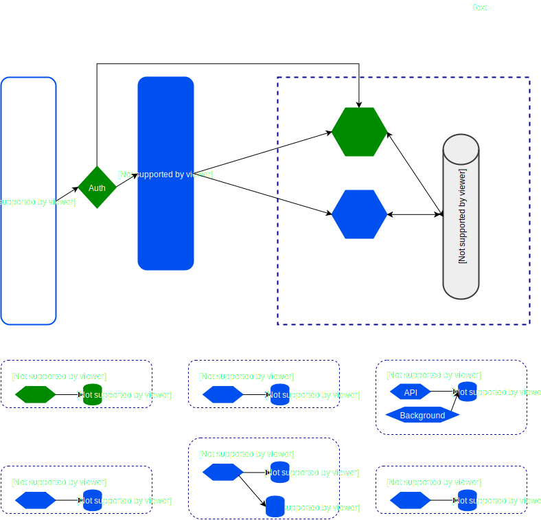

# Shopia

Shopia is an opensource ecommerce app that implement containerised polyglot microservices architecture

## Prerequisites

## Overview of Services Architecture

This architecture demonstrate how microservices communicate with each other. The Dividence of microservices is based on [Business specs](./docs/specs/biz-specs.md)

## Overview of Devops Architecture

## Related documentation and guidance

[Main documentation](./docs)

## Overview of the application code

## Setting up your development environment

## Credits

* Guidlines
 - https://www.devteam.space/wp-content/uploads/2018/04/DevTeamSpace_agile_process_part_1_project_specification.pdf

* Softwares
 - https://structurizr.com/

* Projects
 - https://github.com/dotnet-architecture/eShopOnContainers
